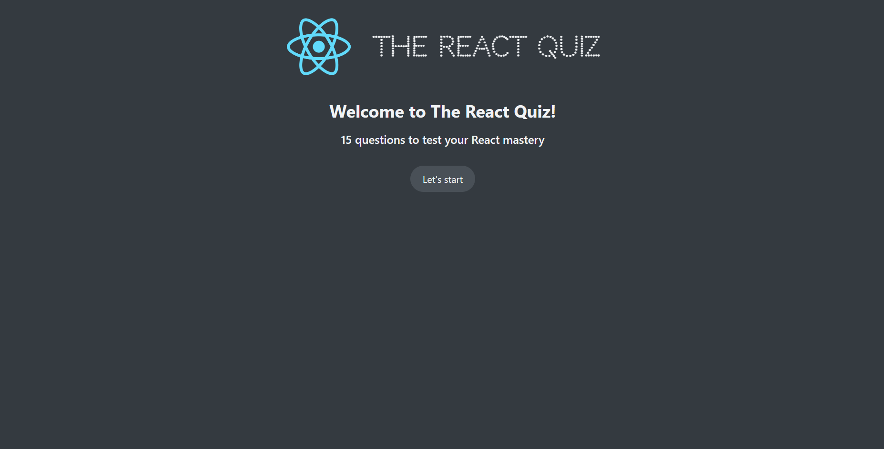

# React Quiz App

The React Quiz App is an interactive quiz application that allows users to attend quizzes with a specified number of questions and a timer. Once the user starts the quiz, the timer begins counting down, and if the time runs out, the quiz ends immediately and moves to the finish screen, where the result is calculated and displayed. Additionally, after the user chooses an answer for a question, the correct answer is shown.

## Installation

To run the React Quiz App locally on your machine, follow these steps:

1-Clone the project repository by executing the following command in your terminal:
git clone https://github.com/Mohamed-Ramadan1/React-Quiz-App.git

2-Install the project dependencies by running: npm install

3-Start the local development server: npm run server

4- Finally, start the application: npm start

## Features.

1-Attend quizzes with a specified number of questions.

2-Timer countdown during the quiz.

3-Automatic quiz termination on timeout.

4-Display of results after the quiz ends.

5-Show correct answers after the user selects an answer for a question.

6-Built using React.js and hooks for a smooth and efficient user experience.

## App preview.

